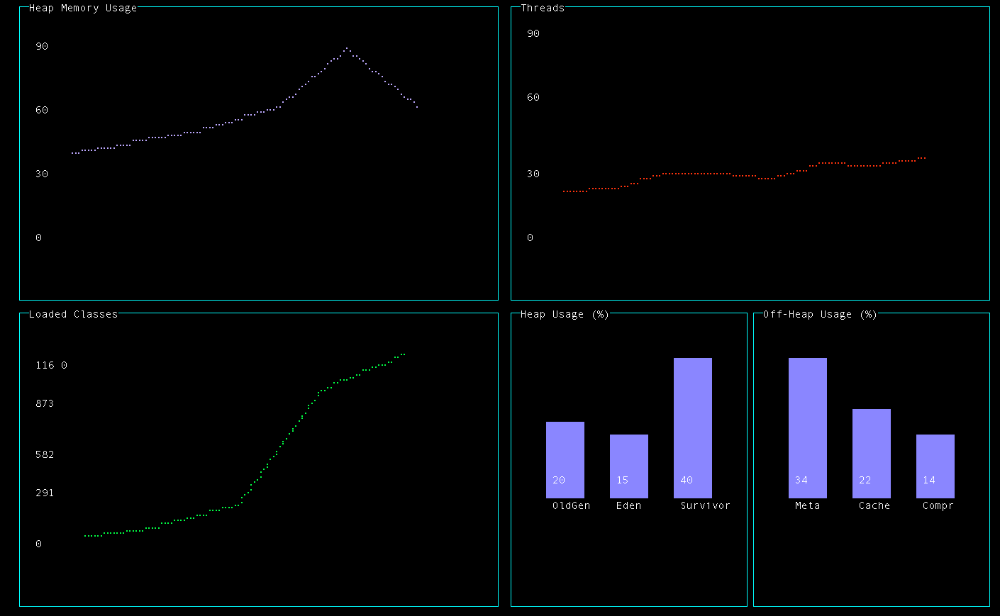

jtop
=============

An htop-style terminal app for JMX enabled JVM apps.




Setup on OS X:

```sh
brew install node
npm install jmx blessed blessed-contrib
```

## Running jtop

From terminal A:

```sh
sbt ~fastOptJS
```

From terminal B:

```sh
sbt fastOptStage::run
```

## Launch test java application (Scala REPL)

Note - this is the Java process serving JMX information.

```sh
export JAVA_OPTS="-Dcom.sun.management.jmxremote.port=8855 -Dcom.sun.management.jmxremote.authenticate=false -Dcom.sun.management.jmxremote.ssl=false" scala
scala
```

## List available MBeans from Scala REPL

```sh
scala
:load list-mbeans.sc
```

## Launch UI

```sh
cd <project root>
./mungeAndRun.sh
```